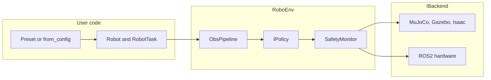

# RoboDeploy

**Backend agnostic runtime for robot learning, evaluation, and sim2real deployment.**

RoboDeploy provides a unified control and observation layer across MuJoCo, Gazebo Harmonic, Isaac Sim, ROS2, and real hardware. Tasks, sensor rigs, and policies are defined once and bound to a backend through a registry; switching simulators or moving to hardware does not require rewriting task logic or sensor integration code. The v0.2 release adds behavioral cloning and PPO training, benchmark evaluation, multimodal sensing (camera, force/torque, IMU, contact), safety enforcement, calibration and domain randomization tooling, and distribution packaging.

| | |
|---|---|
| **Version** | 0.2.0 |
| **Python** | 3.10 to 3.12 |
| **License** | MIT |
| **Status** | Beta. See [docs/PLATFORM_STATUS.md](docs/PLATFORM_STATUS.md) |

## Overview

RoboDeploy is a Python framework for manipulation research and deployment. It standardizes the episode loop, reset, observation, policy inference, action execution, and reward evaluation, across simulation backends and physical robots. A single configuration specification (YAML preset or `RoboEnv.from_config()` dict) selects the backend, robot description, task, policy, and sensor rig; the runtime resolves simulator specific or hardware specific implementations through a central registry.

The architecture is oriented toward closing the simulation to reality gap: training and evaluation use the same observation schema and action contract whether the backend is MuJoCo, Gazebo, Isaac Sim, or ROS2 on a real manipulator. Domain randomization, calibration stores, and transfer metrics provide explicit hooks between simulated and deployed runs rather than implicit code forks.

## Motivation

Manipulation pipelines frequently diverge across development stages. Simulation code paths embed physics engine details; deployment code paths embed ROS topic layouts and driver quirks. Sensor fusion, policy interfaces, and safety limits are reimplemented per stack, which breaks comparability of benchmark results and increases integration cost when moving from simulation to hardware.

RoboDeploy addresses three structural problems:

**Simulator portability.** Backends implement a common `IBackend` interface. Tasks, policies, and sensor rigs are backend agnostic. Changing from MuJoCo to Gazebo Harmonic or from simulation to `real_world` ROS2 control amounts to a configuration change plus backend specific asset paths, not a rewrite of task or policy code.

**Unified sensor and policy integration.** `SensorRig` declarations specify mount frames and modalities (RGBD, wrist force/torque, IMU, contact). The registry instantiates matching `ISensor` implementations for each backend. `ObsPipeline` synchronizes streams, applies noise, and produces a normalized `Observation` consumed by any `IPolicy` implementation, scripted, learned, or served remotely. Policies therefore depend on field names and semantics, not on MuJoCo render buffers or ROS message types.

**Sim2real continuity.** Calibration CLIs (kinematic, extrinsic, hand eye, system identification), domain randomization sweeps, and transfer evaluation tooling operate on the same environment definitions used in training. `SafetyMonitor` enforces workspace, slew rate, force, and velocity limits on both stepping and reset paths, providing a consistent safety envelope from simulation through hardware trials. Benchmark evaluation (`robodeploy eval`) records reproducibility metadata, git revision, package version, seeds, policy checkpoints, in leaderboard JSON suitable for regression tracking across backends.

## Architecture

| Principle | Description |
|-----------|-------------|
| **Registry based composition** | Backends, robots, tasks, policies, and sensors register by name. Wiring occurs through presets, `from_config()`, or programmatic construction. Extensions ship via `pyproject.toml` entry points. |
| **Declarative sensor rigs** | Multimodal sensing is configured in YAML, not hard coded per simulator. Sim and real drivers share observation field contracts. |
| **Observation pipeline** | `ObsPipeline` handles temporal sync, domain randomization noise, and transforms (e.g. vision predicates writing `obs.objects`). |
| **Preset driven reproducibility** | `examples/config/presets.yaml` and benchmark preset files encode full experiment definitions for demos, CI, and evaluation suites. |
| **Training on shared env definitions** | Gymnasium adapters wrap `RoboEnv`. BC and PPO trainers, vec env utilities, and production training scripts use the same configs as interactive presets. |
| **Documented capability boundaries** | Placeholder benchmark tiers are labeled in `spec.json`. Platform and integration status documents distinguish CI verified behavior from planned work. |

## Technology stack

| Layer | Technologies |
|-------|----------------|
| **Language & packaging** | Python 3.10 to 3.12, setuptools, optional extras in `pyproject.toml`, plugin entry points |
| **Core numerics** | NumPy; JAX arrays in observations/actions where backends provide them |
| **Simulation** | [MuJoCo](https://mujoco.org/) (primary), Gazebo Harmonic via ROS2 Jazzy, NVIDIA Isaac Sim (Kit env), internal dummy backend for smoke tests |
| **Robotics middleware** | ROS2 (controllers, sensors, `ros_gz_bridge`, RViz visualization) |
| **Kinematics** | MuJoCo IK, [Pinocchio](https://github.com/stack-of-tasks/pinocchio) (`pin` extra), policy attached IK helpers |
| **Learning** | PyTorch checkpoints, Gymnasium envs, custom BC/PPO trainers, optional Stable-Baselines3 (`rl` extra) |
| **Vision & perception** | RGBD sim cameras, RealSense (`real` extra), color blob predicates, camera extrinsics for unprojection |
| **Force & proprioception** | Wrist F/T, IMU, contact sensors; FT gated task phases in pick policies |
| **Data & observability** | JSONL/HDF5 episode export, eval manifests, optional wandb / TensorBoard / MLflow (`obs` extra) |
| **Evaluation** | `manipulation_v1` benchmark suite, HTML reports, leaderboard submission schema, train→eval E2E tests |
| **Safety** | Composable guards (workspace, slew, force, velocity, collision), e stop API, reset path enforcement |
| **Sim2real** | Calibration store (kinematic, extrinsic, hand eye), DR sweeps, transfer metrics (dummy tested paths) |
| **Serving** | ZMQ/gRPC policy server for remote inference |
| **CI & distribution** | GitHub Actions (pytest, package build, optional Gazebo/PPO nightly), Docker CPU image, conda recipe metadata, PyPI publish workflow |
| **Docs** | MkDocs Material, architecture and contract docs in repo |

**Recommended development install:**

```bash
pip install -e ".[sim,kinematics,dev,training,eval]"
```

Isaac Sim and real hardware require environment specific setup; see [docs/BACKEND_SETUP.md](docs/BACKEND_SETUP.md).

## Runtime model

RoboDeploy separates physics and I/O from task and policy logic:

- **Backends** implement simulation stepping or hardware command interfaces.
- **Tasks** define reward functions, success and failure predicates, and required observation fields.
- **Policies** map `Observation` to `Action` (scripted, imitation learned, reinforcement learned, or remotely served).
- **Sensor rigs** declare mounted modalities; the registry resolves per backend `ISensor` implementations.

The `RoboEnv` control loop is invariant across backends:

```text
reset → observe → (safety) → policy → (adapter) → step → reward / success
```



## Features (v0.2)

| Area | Capabilities |
|------|----------------|
| **Backends** | MuJoCo, Gazebo (ROS2 + Harmonic), Isaac Sim, ROS2 RViz, dummy smoke, real ROS2 |
| **Sensors** | RGBD, wrist FT, IMU, contact, prop pose; `ObsPipeline` sync and noise |
| **Policies** | Reach DSL, joint trackers, BC/PPO checkpoints, diffusion/VLA stubs, remote serving |
| **Training** | Gym adapter, `SubprocVecEnv`, BC + PPO trainers, `examples/train_ppo_reach.py` |
| **Benchmarks** | `manipulation_v1` suite, `robodeploy eval`, HTML reports, leaderboard schema |
| **Safety** | `SafetyMonitor`, workspace/slew limits, force/velocity/collision guards, e stop API |
| **Sim2real** | Calibration store, DR sweep, transfer metrics (dummy/mock paths tested) |
| **Multi robot** | MuJoCo multi arm presets and tests |
| **Distribution** | PyPI workflow ready, Docker CPU image, conda recipe smoke, plugin entry points |

## Install

From the repository root:

```bash
python -m pip install -e .
```

### Optional extras

| Extra | Install | Use case |
|-------|---------|----------|
| `sim` | `pip install -e ".[sim]"` | MuJoCo backend |
| `kinematics` | `pip install -e ".[kinematics]"` | Pinocchio IK for reach policies |
| `real` | `pip install -e ".[real]"` | RealSense camera helpers |
| `dev` | `pip install -e ".[dev]"` | Tests, JAX, torch, gymnasium |
| `training` | `pip install -e ".[training]"` | BC/PPO training stack |
| `eval` | `pip install -e ".[eval]"` | Benchmark HTML reports |
| `learned` | `pip install -e ".[learned]"` | HF hub + transformers policies |
| `rl` | `pip install -e ".[rl]"` | Stable-Baselines3 smoke |
| `teleop` | `pip install -e ".[teleop]"` | Keyboard / SpaceMouse / LeRobot (WIP) |
| `obs` | `pip install -e ".[obs]"` | wandb, tensorboard, mlflow sinks |
| `docs` | `pip install -e ".[docs]"` | MkDocs site build |

**Recommended dev setup:**

```bash
python -m pip install -e ".[sim,kinematics,dev,training,eval]"
robodeploy doctor
```

Isaac Sim uses NVIDIA's Kit Python environment; the `isaacsim` extra is a marker only.

## Quick start (5 minutes)

**Pick-and-place demo (self-contained, no `examples/` imports):** edit `SIMULATOR` in [`demo/run_pick.py`](demo/run_pick.py) (`mujoco` | `rviz` | `gazebo`) and run `python demo/run_pick.py`. Full guide: [`demo/README.md`](demo/README.md). MuJoCo works on native Windows; RViz and Gazebo need WSL2/Linux with ROS 2 Jazzy.

```bash
# 1. Environment check
robodeploy doctor

# 2. No simulator required
robodeploy run-episode --dummy --steps 10 --json

# 3. Kuka pick demo (MuJoCo on Windows; task/policy live under demo/)
pip install -e ".[sim,kinematics]"
python demo/run_pick.py

# 4. List CLI presets (examples/, parallel task/policy names)
python -m examples.cli list-presets

# 5. MuJoCo pick via examples preset
python -m examples.cli run-episode --preset kuka_pick_mujoco --steps 50

# 6. Tier 1 benchmark eval on dummy backend
robodeploy eval --benchmark manipulation_v1/reach_target --backend dummy --episodes 5
```

**Preset → env → step** (Python):

```python
from examples.env_from_preset import env_from_preset

env = env_from_preset("kuka_pick_mujoco")
obs, info = env.reset()
obs, reward, done, info = env.step()  # policy from preset when action is None
env.close()
```

Presets live in [`examples/config/presets.yaml`](examples/config/presets.yaml). They wire backend, task, policy, sensor rigs, and optional `obs_pipeline` / `custom_modules`.

## Core API

### Preset based (recommended for demos)

See quick start above. Full preset catalog: [examples/README.md](examples/README.md).

### Programmatic

```python
from robodeploy import RoboEnv, Robot, RobotTask, use
from robodeploy.backends.simulator import backend_for_simulator
from robodeploy.description.franka import FrankaDescription
from examples.tasks.pick_place import PickPlaceTask
from my_pkg.policies import MyPolicy

use("examples.tasks")
robot = Robot(
    robot_id="robot0",
    description=FrankaDescription(),
    tasks={
        "pick": RobotTask(task=PickPlaceTask(), policies={"main": MyPolicy()}),
    },
)
backend = backend_for_simulator("mujoco", robots=[robot])
env = RoboEnv(backend=backend, robots=[robot])
obs, info = env.reset()
obs, reward, done, info = env.step()
env.close()
```

### Config dict (canonical for apps)

```python
from robodeploy import RoboEnv, use

use("my_project.components")
env = RoboEnv.from_config({
    "backend": "mujoco",
    "robots": [{"id": "robot0", "description": "kuka", "task": "pick_place", "policy": "example_sensor_reach_pick"}],
    "sensor_rigs": [...],
    "custom_modules": ["examples.tasks", "examples.policies"],
})
```

See [CONTRACTS.md](CONTRACTS.md) for construction rules and [docs/PROJECT_GUIDE.md](docs/PROJECT_GUIDE.md) for the full mental model.

## CLI overview

| Command | Purpose |
|---------|---------|
| `robodeploy doctor` | Check MuJoCo, ROS2, Gazebo, torch, calibration dirs |
| `robodeploy list-registry` | Backends, robots, tasks, policies, sensors |
| `robodeploy run-episode --dummy` | Simulator free smoke |
| `robodeploy export-episode --dummy` | Record dummy episode to JSONL/HDF5 |
| `robodeploy eval --benchmark ...` | Run `manipulation_v1` benchmarks |
| `robodeploy eval-compare` | Diff two eval JSON reports → HTML |
| `robodeploy list-benchmarks` | List suites and tasks |
| `robodeploy leaderboard submit/show` | Leaderboard JSON workflow |
| `robodeploy train bc` / `train ppo` / `train eval` | Train or eval checkpoints |
| `robodeploy scaffold task|policy|preset|...` | Generate boilerplate |
| `robodeploy calibrate kinematic|extrinsic|handeye|system-id` | Calibration CLIs |
| `robodeploy dr-sweep` / `transfer-eval` | Sim2real sweeps (dummy) |
| `robodeploy safety check|test|status` | Safety monitor tooling |
| `robodeploy serve-policy` | ZMQ/gRPC policy server |
| `robodeploy config show|resolve|validate|diff` | Preset inspection |
| `robodeploy assets list|resolve|verify` | Bundled asset helpers |
| `python -m examples.cli run-episode --preset ...` | Run YAML presets from `examples/` |

Full reference: [docs/CLI_REFERENCE.md](docs/CLI_REFERENCE.md).

## Training and evaluation

```bash
# Behavioral cloning on dummy env
robodeploy train bc --dataset path/to/dataset --dummy --epochs 50

# PPO reach_target (production scale script)
python examples/train_ppo_reach.py --backend dummy --total-steps 500000
python examples/train_ppo_kuka_pick.py --total-steps 100000

# Eval trained checkpoint on benchmark
robodeploy train eval --checkpoint bc_final.pt --dummy
robodeploy eval --benchmark manipulation_v1/reach_target --backend dummy --policy bc_final.pt
```

Details: [docs/TRAINING.md](docs/TRAINING.md), [benchmarks/README.md](benchmarks/README.md).

## Backends

| Name | Factory string | Notes |
|------|----------------|-------|
| MuJoCo | `mujoco` | Primary dev backend; EGL headless in CI |
| Gazebo | `gazebo` | Alias for `ros2_gazebo`; Linux + Jazzy + Harmonic |
| ROS2 RViz | `ros2_rviz` | Visualization + optional fake joint sim |
| Isaac Sim | `isaacsim` | Mock tested in CI; GPU Kit for live |
| Real hardware | `real_world` | ROS2 controllers + sensors |
| Dummy | `dummy` | No physics; registry and CLI smoke |

Setup: [docs/BACKEND_SETUP.md](docs/BACKEND_SETUP.md).

### Gazebo multimodal pick (Linux)

```bash
pip install -e ".[kinematics,dev]"
ROBODEPLOY_LIVE_GAZEBO=1 pytest -m live_gazebo -q   # CI equivalent smoke
python -m examples.kuka_ft_imu_pick_gazebo.run_gazebo
```

Expect `obs.images`, `obs.ft_forces`, `obs.imu_angular_velocity`, `obs.contact_state`, and `obs.objects` after reset. Troubleshooting: controller topics at `/joint_states` (not `/robot0/joint_states`).

## Sensors

Declare **`SensorRig`** entries in preset YAML or `from_config`. The registry resolves backend appropriate `ISensor` implementations (not a simple sim/real flag).

| Logical sensor | Typical mount | Observation fields |
|----------------|---------------|-------------------|
| `wrist_camera` | `ee_link` | `images`, `depths`, intrinsics/extrinsics |
| `wrist_ft` | `ee_link` | `ft_forces`, `ft_torques` |
| `wrist_imu` / `base_imu` | link | `imu_acceleration`, `imu_angular_velocity` |
| `wrist_contact` | `ee_link` | `contact_state` |
| `sim_prop_pose` | n/a | `objects` (example oracle; sim only) |

`ObsPipeline` applies sync, noise (domain randomization), and transforms such as color blob → `obs.objects`. Policies should consume **`obs.objects`** and camera data, not `backend.get_prop_pose()` in new code.

Guide: [docs/SENSOR_INTEGRATION.md](docs/SENSOR_INTEGRATION.md). Audit checklist: [SENSOR_INTEGRATION_TODO.md](SENSOR_INTEGRATION_TODO.md).

## Safety

`SafetyMonitor` runs before actions reach the backend on both `step()` and `reset_routine()` paths:

- Workspace and slew rate limits via robot description filters
- Force, velocity, collision, and e stop guards
- `env.emergency_stop()` / `env.reset_safety()` for operator control

```bash
robodeploy safety check --preset kuka_pick_mujoco
robodeploy safety test --dummy
```

Guide: [docs/SAFETY.md](docs/SAFETY.md).

## Benchmarks

```bash
robodeploy list-benchmarks
robodeploy eval --benchmark manipulation_v1/reach_target --backend dummy --episodes 20 --output report.json
robodeploy eval --benchmark manipulation_v1 --backend dummy --episodes 10 --output suite.json
```

Tier 1 `reach_target` is the primary live task. Tiers 2 to 8 are labeled `task_status: placeholder` in `benchmarks/manipulation_v1/spec.json`. See [benchmarks/README.md](benchmarks/README.md) before interpreting scores.

## Project layout

```text
robodeploy/              Installable package (see table below)
examples/                Presets, demo tasks/policies, examples.cli (not on PyPI)
benchmarks/              manipulation_v1, sim2real suites, leaderboard schema
tests/                   Unit, smoke, hardware gated tests
docs/                    MkDocs guides and tutorials
plans/                   Strategic goal plans + integration status
docker/                  CPU image for CI smoke
conda-recipe/            conda forge recipe metadata
```

### `robodeploy/` package map

| Path | Purpose |
|------|---------|
| `env.py` | `RoboEnv`: episode loop, safety, obs validation |
| `bridge.py` | `RoboBridge`: decoupled control vs inference loops (real hardware) |
| `core/` | Types, registry, `Robot`/`RobotTask`, sensor rigs, scene validation |
| `backends/` | MuJoCo, Gazebo, Isaac Sim, ROS2 RViz, real ROS2, dummy |
| `description/` | Robot URDF/MJCF assets (Kuka, Franka, SO101, …) |
| `tasks/` | `TaskBase`, templates, domain randomization, success predicates |
| `policies/` | Policy base, reach DSL, learned adapters, remote serving |
| `sensors/` | Camera, FT, IMU, contact; sim and real drivers |
| `obs_pipeline/` | Transforms, sync buffers, fusion |
| `perception/` | Vision predicates and helpers |
| `kinematics/` | MuJoCo IK, Pinocchio, policy IK attachment |
| `training/` | Gym adapter, BC, PPO, datasets, `SubprocVecEnv` |
| `evaluation/` | Benchmark harness, metrics, HTML reports, video |
| `safety/` | `SafetyMonitor`, guards, violation types |
| `sim2real/` | Calibration store, DR, transfer metrics |
| `calibration/` | Kinematic, extrinsic, hand eye, system ID |
| `teleop/` | Teleop session contract (keyboard stub; full IL WIP) |
| `observability/` | Replay, manifests, seeding, health |
| `ros2/` | `Ros2Runtime`, topic helpers, devtools |
| `multirobot/` | Multi-arm scene helpers |
| `viz/` | RViz markers and traces |
| `testing/` | `DummyBackend`, dummy task/policy for smoke tests |

`examples/` is **not** shipped as importable package data on PyPI; clone the repo or vendor presets for demos.

## Documentation

| Document | Audience |
|----------|----------|
| [docs/PROJECT_GUIDE.md](docs/PROJECT_GUIDE.md) | **Start here**: comprehensive platform guide |
| [docs/index.md](docs/index.md) | MkDocs home + doc map |
| [ARCHITECTURE.md](ARCHITECTURE.md) | Layer diagram and design principles |
| [CONTRACTS.md](CONTRACTS.md) | Public API contracts |
| [demo/README.md](demo/README.md) | **Kuka pick demo** (`demo/`: task, policy, MuJoCo/RViz/Gazebo) |
| [docs/DEMO_RUNBOOK.md](docs/DEMO_RUNBOOK.md) | Live demo rehearsal (CLI presets + Docker/WSL) |
| [examples/README.md](examples/README.md) | Runnable examples and YAML presets |
| [docs/PLATFORM_STATUS.md](docs/PLATFORM_STATUS.md) | What CI proves vs what is planned |
| [docs/RELEASE.md](docs/RELEASE.md) | Versioning, PyPI, PR checklist |
| [CONTRIBUTING.md](CONTRIBUTING.md) | How to contribute |
| [BROAD_GOALS.md](BROAD_GOALS.md) | Strategic goals index (see plans/ for current status) |
| [plans/INTEGRATION_STATUS.md](plans/INTEGRATION_STATUS.md) | CI ↔ preset honesty audit |

**Build docs locally:**

```bash
pip install -e ".[docs]"
mkdocs serve
```

## Development

```bash
python -m pytest -m "not hardware" -q          # full suite (~620 tests)
python -m pytest tests/training/ -q            # training only
python -m pytest tests/test_cli.py tests/test_presets.py -q   # quick smoke
python -m compileall robodeploy tests examples
```

| Marker | Meaning |
|--------|---------|
| `hardware` | Real robot; skipped by default |
| `slow` | PPO convergence; minutes |
| `live_gazebo` | Linux + Gazebo (`ROBODEPLOY_LIVE_GAZEBO=1`) |
| `optional_nightly` | 50k PPO proxy; mirrors `ppo-nightly.yml` |

Hardware gated tests: [tests/HARDWARE_TESTS.md](tests/HARDWARE_TESTS.md).

## Roadmap

Version 0.2 on `main` delivers the integration core for simulator switching, sensor/policy wiring, and benchmark evaluation. Remaining work includes teleoperation and imitation learning data collection, Gazebo pick reliability targets, PyPI release of `v0.2.0`, Isaac Sim GPU parity, and automated real hardware benchmark runs. See [docs/PLATFORM_STATUS.md](docs/PLATFORM_STATUS.md) for CI verified capabilities.

- Strategic plans: [plans/README.md](plans/README.md)
- Wave 2 follow-ups: `plans/WAVE2_0N_*.md`
- Contributor integration audit: [plans/INTEGRATION_STATUS.md](plans/INTEGRATION_STATUS.md)
- Representation/sensor upgrade notes: [REPRESENTATION_UPGRADE_PLAN.md](REPRESENTATION_UPGRADE_PLAN.md), [SENSOR_INTEGRATION_TODO.md](SENSOR_INTEGRATION_TODO.md)

## Contributing

Issues and PRs welcome. Read [CONTRIBUTING.md](CONTRIBUTING.md) before large changes.
