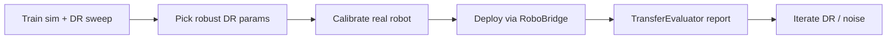

# Sim-to-Real Workflow

End-to-end guide for training in simulation, calibrating hardware, deploying on real robots, and measuring the sim–real gap.

## Overview



## 1. Train with domain randomization sweep

Run a sensitivity sweep to find DR settings that maximize success under noise:

```bash
robodeploy dr-sweep --dummy --output reports/dr_sweep_001/ --seeds 3 --episodes 5
```

For preset-based training, use the example runner:

```bash
python -m examples.sim2real.run_dr_sweep --pair kuka_pick_mujoco --output reports/dr_sweep/
```

Pick the cell with highest `success_rate` in `dr_sweep_report.json` and attach those DR params to your training preset via `task_kwargs.domain_randomization`.

## 2. Calibrate the real robot

### Kinematic (SO-101)

```bash
python -m examples.so101.calibrate_so101 --port /dev/ttyACM0 --out ~/.robodeploy/so101_calibration.json
robodeploy calibrate kinematic --robot so101 --port /dev/ttyACM0 --json
```

Artifacts are stored in `~/.robodeploy/calibration/<robot_id>/`.

### Camera extrinsics (checkerboard)

```bash
robodeploy calibrate extrinsic --camera wrist --pattern checkerboard --board 7x5x0.025 --json
```

### Hand-eye (ArUco)

```bash
robodeploy calibrate handeye --robot franka --pattern aruco --method park --json
```

### System identification

```bash
robodeploy calibrate system-id --robot franka --joint 4 --dummy --json
```

On real hardware, omit `--dummy` and run against a live `RoboEnv`.

## 3. Deploy with RoboBridge + LatencyModel

```python
from robodeploy import RoboBridge
from robodeploy.bridge import LatencyModel

latency = LatencyModel(mean_delay_s=0.02, jitter_std_s=0.005)
async with RoboBridge(env, env_factory=make_env, latency_model=latency) as bridge:
    await bridge.run()
```

`LatencyModel` buffers recent actions and interpolates commands to absorb inference jitter at the higher `control_hz`.

## 4. Measure transfer gap

```bash
robodeploy transfer-eval --dummy --output transfer_report/ --episodes 20 --json
```

Produces:

- `transfer_metrics.json` — sim vs real success rates, trajectory distance, obs KL
- `manifest.json` — GOAL_10 `RunManifest` for reproducibility
- `transfer_report.json` — combined manifest + metrics

For matched sim/real presets:

```bash
python -m examples.cli run --preset kuka_pick_mujoco   # sim baseline
# deploy on real with same policy checkpoint
robodeploy transfer-eval --dummy --output reports/transfer_001/
```

## 5. Reality-gap benchmarks

```bash
robodeploy eval --benchmark sim2real/reach_to_target --policy benchmark_reach_scripted --backend dummy --episodes 50 --output reach_report.json
```

| Task | Sim target | Real target | Suite import |
|------|-----------|-------------|--------------|
| `reach_to_target` | 95% | 80% | `manipulation_v1/reach_target` |
| `pick_place_cube` | 85% | 60% | `manipulation_v1/pick_place_cube` |
| `peg_insert` | 70% | 40% | `examples.tasks.peg_insertion` |

Benchmark presets live under `benchmarks/sim2real/` and **import** GOAL_11 tasks rather than duplicating them.

## 6. Realistic noise models (sim training)

Add to your sim `ObsPipeline`:

```python
from robodeploy.core.transforms import (
    ColoredNoiseTransform,
    DropoutTransform,
    LatencyTransform,
    QuantizationTransform,
    BiasDriftTransform,
)

sim_pipeline = ObsPipeline([
    ColoredNoiseTransform(kind="ou", sigma=0.002, dt=0.02, tau=0.5),
    LatencyTransform(latency_steps=2),
    DropoutTransform(p=0.01, max_stale_steps=5),
    QuantizationTransform(ticks_per_unit={"joint_positions": 651.9}),
    BiasDriftTransform(drift_rate=1e-5, max_drift=0.01),
])
```

Action noise in task config:

```yaml
task_kwargs:
  action_noise:
    joint_noise_std: 0.001
    command_dropout_p: 0.01
  external_disturbance:
    force_range_N: [0.0, 2.0]
    probability_per_step: 0.002
```

## Checklist

- [ ] DR sweep completed; robust params selected
- [ ] Kinematic calibration saved to `CalibrationStore`
- [ ] Camera extrinsics / hand-eye calibrated
- [ ] System-ID (friction + payload) recorded
- [ ] Sim pipeline includes latency, dropout, colored noise
- [ ] Policy deployed via `RoboBridge` with `LatencyModel`
- [ ] `TransferEvaluator` report generated with `RunManifest`
- [ ] `sim2real/reach_to_target` meets 95% sim / 80% real targets

## Troubleshooting

| Symptom | Likely cause | Fix |
|---------|--------------|-----|
| Policy works in sim but trembles on real | Low control rate / no latency model | Increase `control_hz`; enable `LatencyModel` |
| Systematic position offset | Missing extrinsic calibration | Run checkerboard / hand-eye calibration |
| Grasp slips on real only | Contact model mismatch | Increase DR friction range; add `ExternalDisturbanceInjector` |
| Delayed reactions | Obs latency not modeled | Add `LatencyTransform(latency_steps=2)` in sim pipeline |
| Drifting IMU bias on real | No bias drift in sim | Add `BiasDriftTransform` to sim pipeline |
